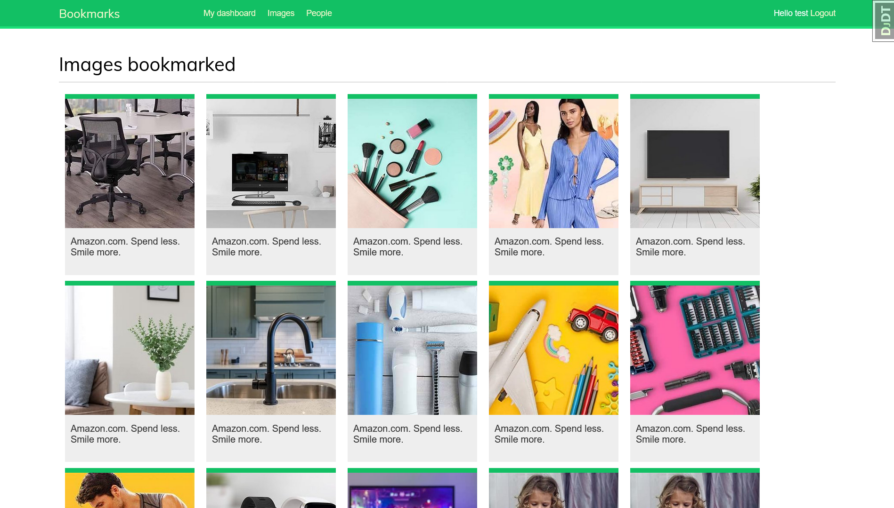

# Bookmarks - Закладки изображений

Учебное приложение соцсети закладок изображений (Pinterest)



## Функции приложения
- Аутентификация
  - Вход через Логин или Email и пароль
  - Вход через Google
  - Вход через Facebook
  - Вход через Twitter
- Редактирование профиля
- Просмотр всех закрепленных изображений
- Букмарклет извлечения изображений с других сайтов и сохранение его на платформе
- Отслеживание действий пользователя
  - Просмотры
  - Лайки
  - Создание новых изображений
- Подписка на других пользователей

## Пройденные темы
- Аутентификация (email + password, войти через Google, войти через Facebook, войти через Twitter)
- Работа с медиа файлами
- Работа с HTTPS
- Работа с `AJAX`
- Отношение многие-ко-многим
- Оптимизация наборов запросов через `select_related`, `prefetch_related`
- Работа с сигналами
- Встраивание `Redis` для отслеживания действий пользователя

### Запуск redis
```shell
docker run -it --rm --name redis -p 6379:6379 redis
```


_Основано на материалах книги "Django 4 в примерах [2023] Антонио Меле"_